# Weyland-Yutani desktop backgrounds

4K (3840×2160) Windows desktop backgrounds built around the Weyland-Yutani
ASCII logo, plus the Python scripts that generate them. This is personal fan
art for the *Alien* franchise.

| Folder | Contents |
|---|---|
| `wallpapers/` | the rendered wallpapers (`wy-*.png`) |
| `previews/` | small JPEG previews used by the gallery below |
| `work/` | generator scripts and the cleaned-up logo data they read |
| `images/1.webp` | the original photo of the logo that everything is traced from |

## Gallery

Click a preview to open the full 4K wallpaper.

### Workstation logo styles

<table>
<tr>
<td width="50%"><a href="wallpapers/wy-12f-type-ascii.png">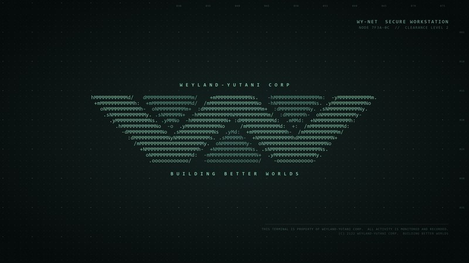</a><br><sub>Original characters in Consolas · <code>wy-12f-type-ascii</code></sub></td>
<td width="50%"><a href="wallpapers/wy-12g-type-fine-ascii.png">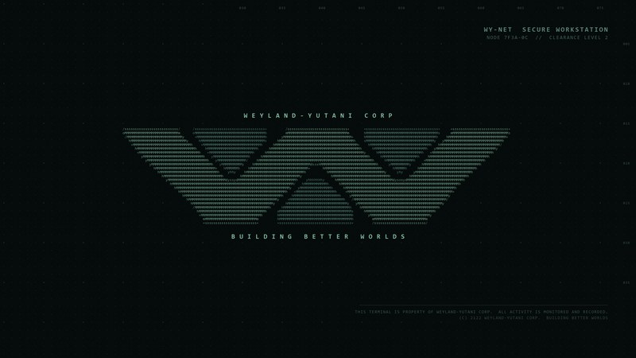</a><br><sub>Fine ASCII · <code>wy-12g-type-fine-ascii</code></sub></td>
</tr>
<tr>
<td width="50%"><a href="wallpapers/wy-12h-type-hex-stream.png">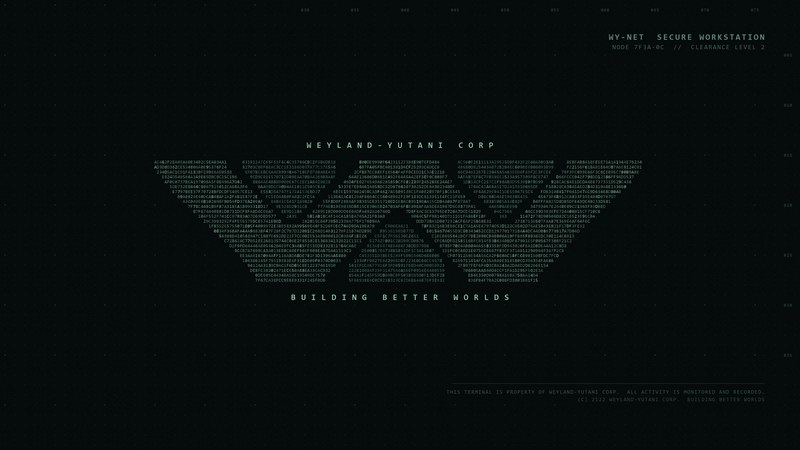</a><br><sub>Hex stream · <code>wy-12h-type-hex-stream</code></sub></td>
<td width="50%"><a href="wallpapers/wy-12i-type-katakana.png">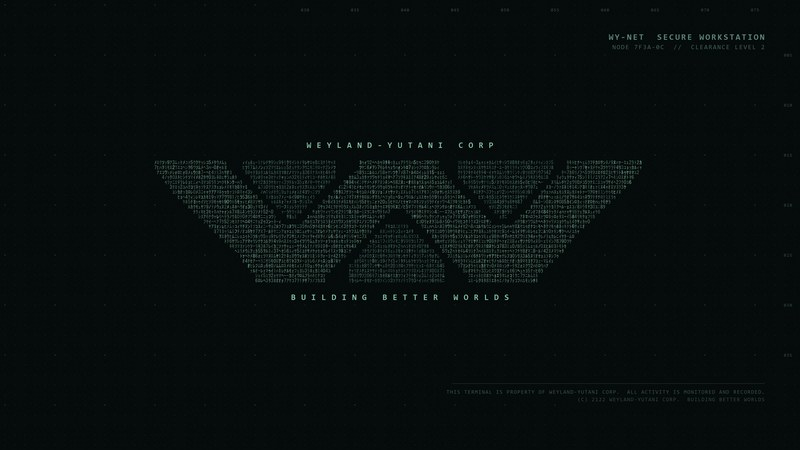</a><br><sub>Katakana · <code>wy-12i-type-katakana</code></sub></td>
</tr>
<tr>
<td width="50%"><a href="wallpapers/wy-12j-type-wordmark.png">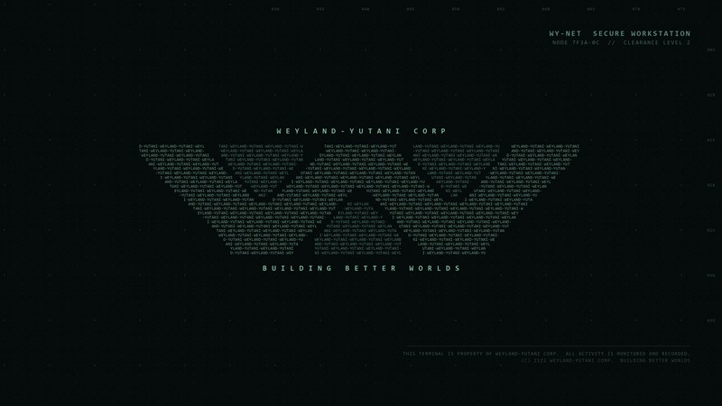</a><br><sub>Wordmark · <code>wy-12j-type-wordmark</code></sub></td>
<td width="50%"><a href="wallpapers/wy-12m-hybrid-hex-ascii.png">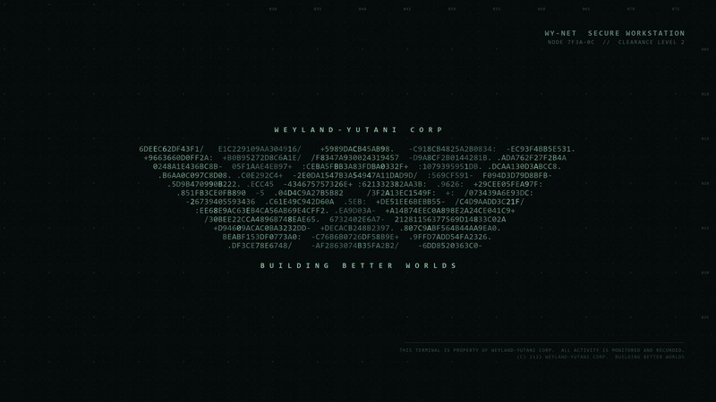</a><br><sub>Hex-ASCII hybrid · <code>wy-12m-hybrid-hex-ascii</code></sub></td>
</tr>
<tr>
<td width="50%"><a href="wallpapers/wy-12n-hybrid-two-tone.png">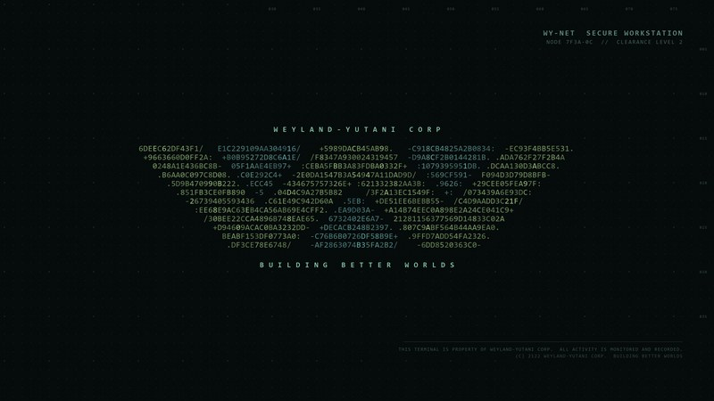</a><br><sub>Hybrid, two-tone · <code>wy-12n-hybrid-two-tone</code></sub></td>
<td width="50%"><a href="wallpapers/wy-12n1-pop-bright.png">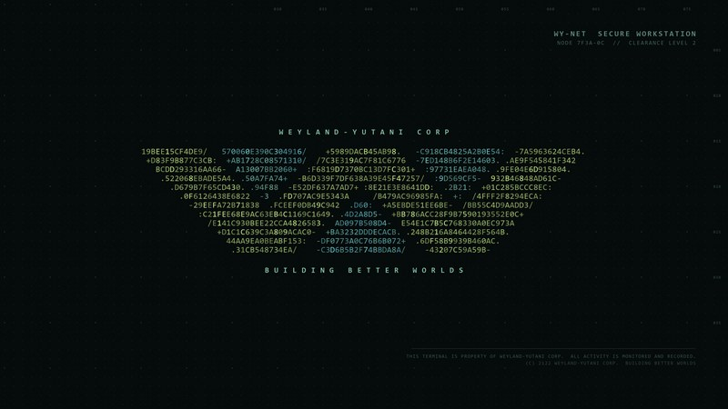</a><br><sub>Pop: bright · <code>wy-12n1-pop-bright</code></sub></td>
</tr>
<tr>
<td width="50%"><a href="wallpapers/wy-12n2-pop-bold.png">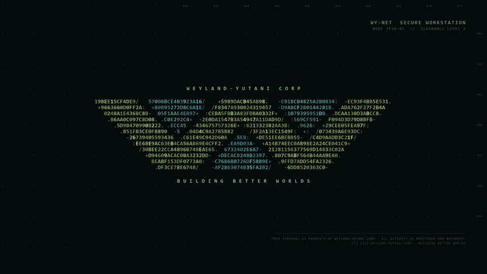</a><br><sub>Pop: bold · <code>wy-12n2-pop-bold</code></sub></td>
<td width="50%"><a href="wallpapers/wy-12n3-pop-glow.png">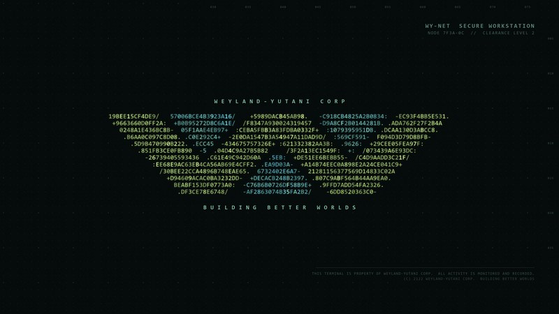</a><br><sub>Pop: glow · <code>wy-12n3-pop-glow</code></sub></td>
</tr>
<tr>
<td width="50%"><a href="wallpapers/wy-12n4-pop-backlit.png">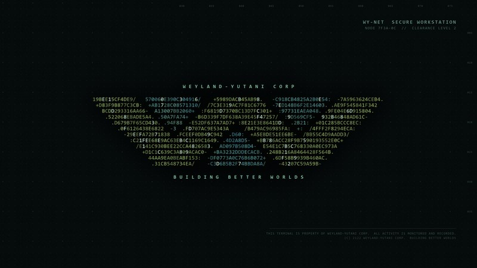</a><br><sub>Pop: backlit · <code>wy-12n4-pop-backlit</code></sub></td>
<td width="50%"><a href="wallpapers/wy-12n5-pop-sweep.png">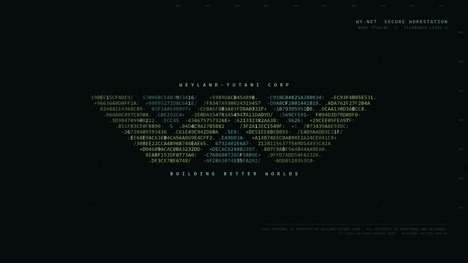</a><br><sub>Pop: sweep · <code>wy-12n5-pop-sweep</code></sub></td>
</tr>
<tr>
<td width="50%"><a href="wallpapers/wy-12n6-pop-combo.png">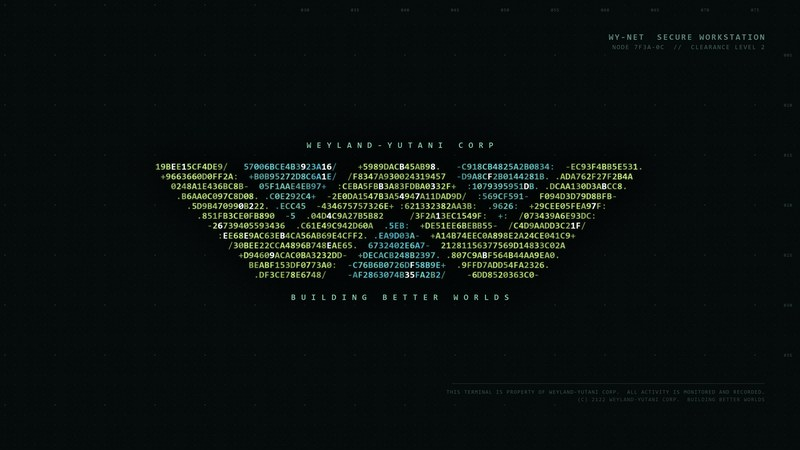</a><br><sub>Pop: combo · <code>wy-12n6-pop-combo</code></sub></td>
<td width="50%"><a href="wallpapers/wy-12n7-bold-soft.png">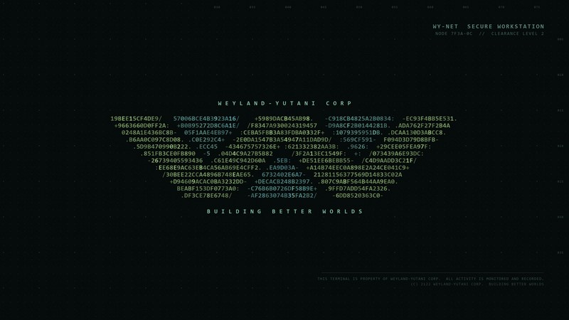</a><br><sub>Bold, soft colours · <code>wy-12n7-bold-soft</code></sub></td>
</tr>
<tr>
<td width="50%"><a href="wallpapers/wy-12o-hex-stream-two-tone.png">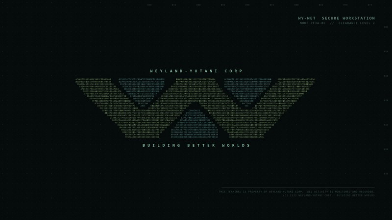</a><br><sub>Hex stream, two-tone · <code>wy-12o-hex-stream-two-tone</code></sub></td>
<td width="50%"></td>
</tr>
</table>

### Corporate set

<table>
<tr>
<td width="50%"><a href="wallpapers/wy-11-corporate-survey.png">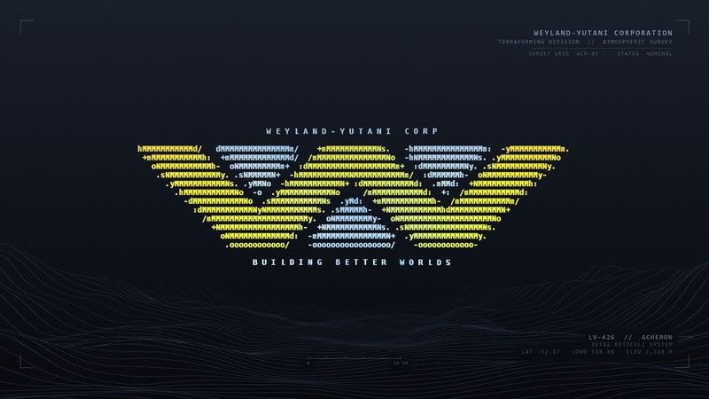</a><br><sub>Survey · <code>wy-11-corporate-survey</code></sub></td>
<td width="50%"><a href="wallpapers/wy-12-corporate-workstation.png">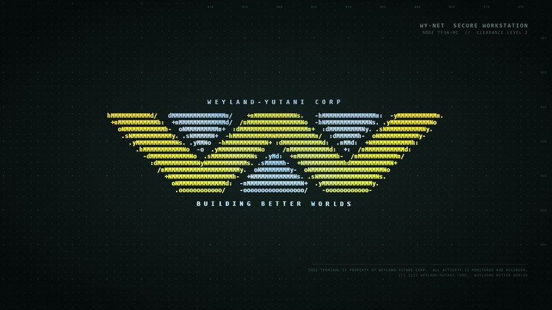</a><br><sub>Workstation · <code>wy-12-corporate-workstation</code></sub></td>
</tr>
<tr>
<td width="50%"><a href="wallpapers/wy-12b-workstation-green.png">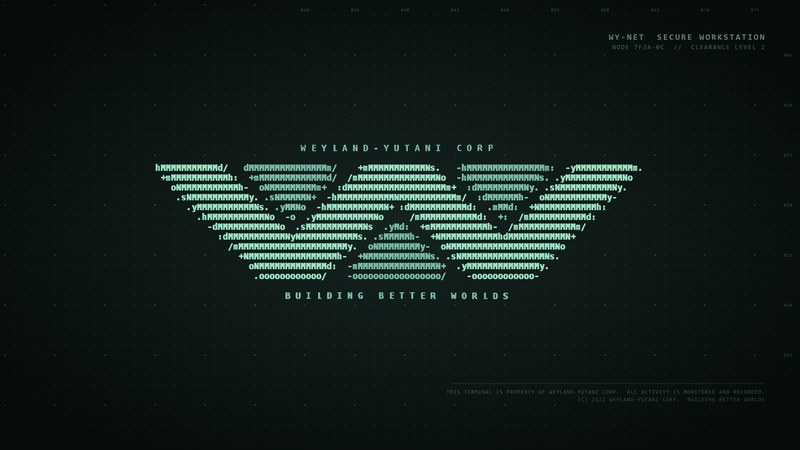</a><br><sub>Workstation, green logo · <code>wy-12b-workstation-green</code></sub></td>
<td width="50%"><a href="wallpapers/wy-12c-workstation-dot-logo.png">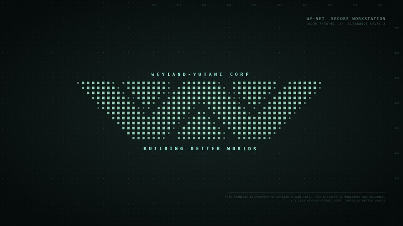</a><br><sub>Workstation, dot logo · <code>wy-12c-workstation-dot-logo</code></sub></td>
</tr>
<tr>
<td width="50%"><a href="wallpapers/wy-12d-workstation-dot-logo-colour.png">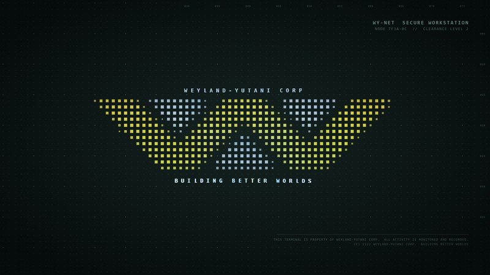</a><br><sub>Workstation, dot logo in colour · <code>wy-12d-workstation-dot-logo-colour</code></sub></td>
<td width="50%"><a href="wallpapers/wy-12e-workstation-dot-logo-bold.png">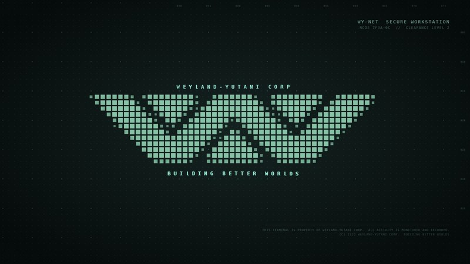</a><br><sub>Workstation, bold dot logo · <code>wy-12e-workstation-dot-logo-bold</code></sub></td>
</tr>
<tr>
<td width="50%"><a href="wallpapers/wy-13-corporate-orbital.png">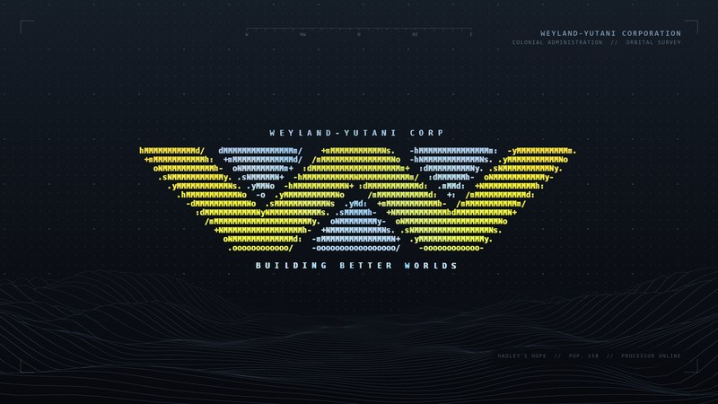</a><br><sub>Orbital · <code>wy-13-corporate-orbital</code></sub></td>
<td width="50%"><a href="wallpapers/wy-14-corporate-executive.png">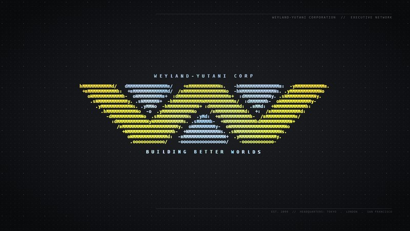</a><br><sub>Executive · <code>wy-14-corporate-executive</code></sub></td>
</tr>
</table>

### 3D backgrounds

<table>
<tr>
<td width="50%"><a href="wallpapers/wy-6-grid-corridor.png">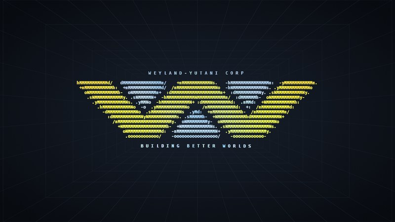</a><br><sub>Grid corridor · <code>wy-6-grid-corridor</code></sub></td>
<td width="50%"><a href="wallpapers/wy-7-grid-horizon.png">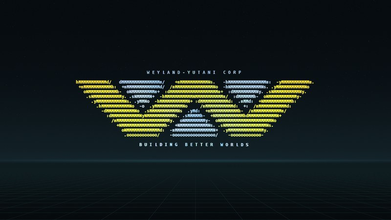</a><br><sub>Grid horizon · <code>wy-7-grid-horizon</code></sub></td>
</tr>
<tr>
<td width="50%"><a href="wallpapers/wy-8-wireframe-terrain.png">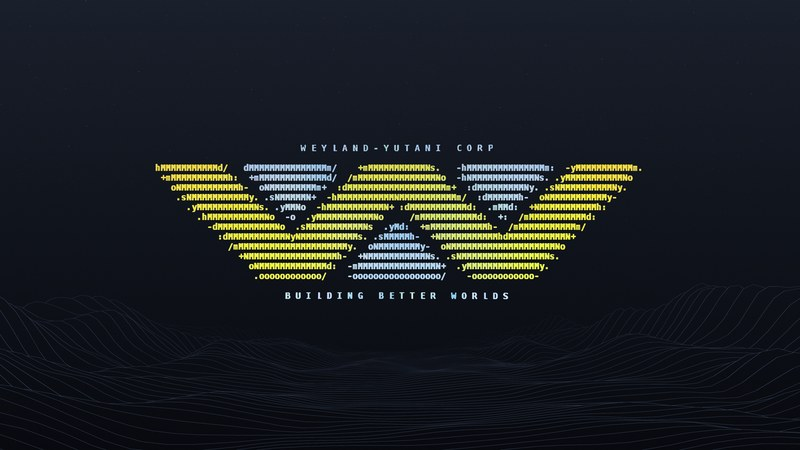</a><br><sub>Wireframe terrain · <code>wy-8-wireframe-terrain</code></sub></td>
<td width="50%"><a href="wallpapers/wy-9-planet-orbit.png">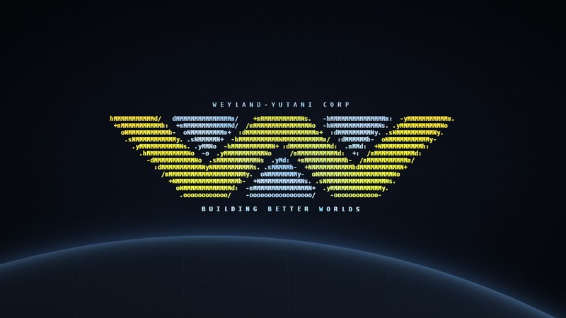</a><br><sub>Planet orbit · <code>wy-9-planet-orbit</code></sub></td>
</tr>
<tr>
<td width="50%"><a href="wallpapers/wy-10-dot-grid.png">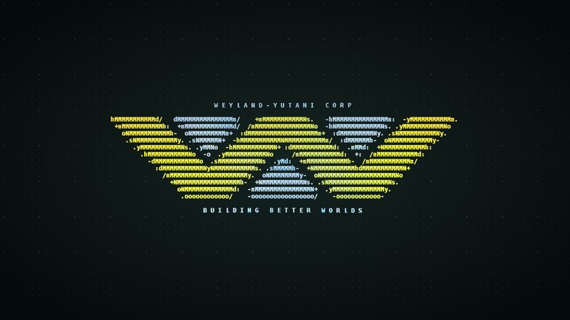</a><br><sub>Dot grid · <code>wy-10-dot-grid</code></sub></td>
<td width="50%"></td>
</tr>
</table>

### Gradient backgrounds

<table>
<tr>
<td width="50%"><a href="wallpapers/wy-1-deep-space.png">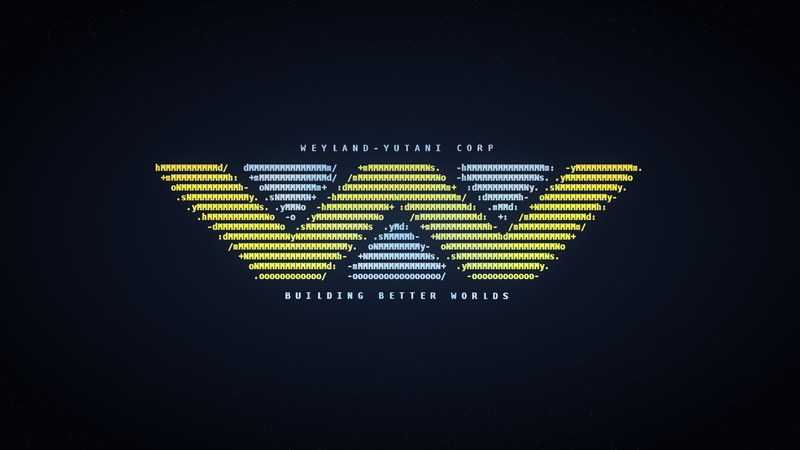</a><br><sub>Deep space · <code>wy-1-deep-space</code></sub></td>
<td width="50%"><a href="wallpapers/wy-2-crt-terminal.png">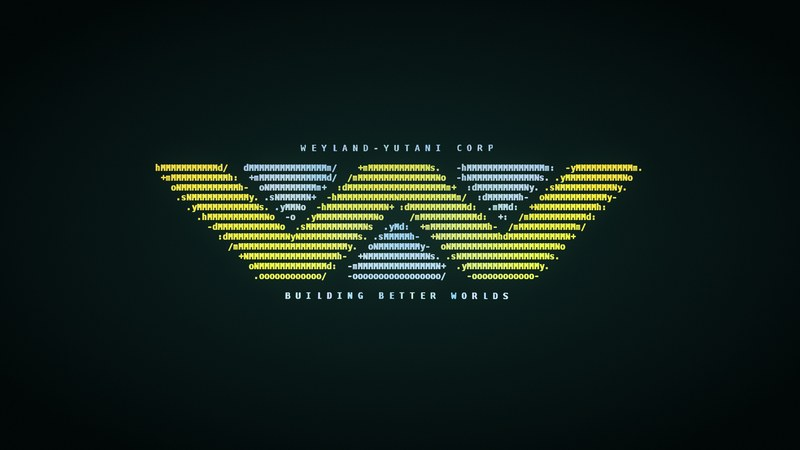</a><br><sub>CRT terminal · <code>wy-2-crt-terminal</code></sub></td>
</tr>
<tr>
<td width="50%"><a href="wallpapers/wy-3-amber-haze.png">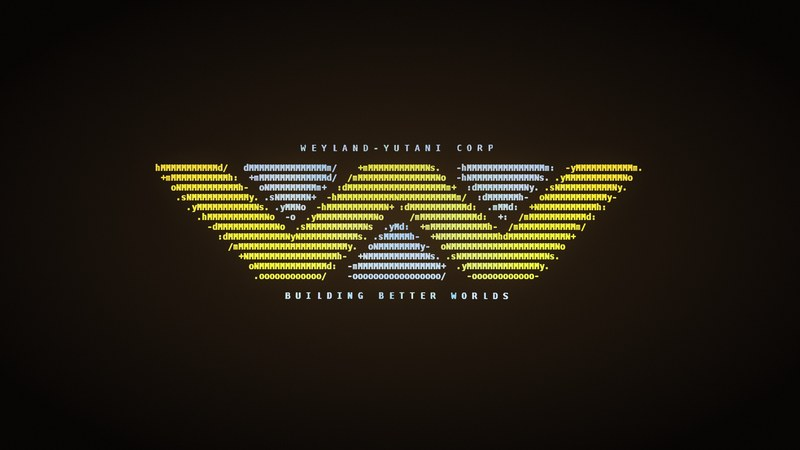</a><br><sub>Amber haze · <code>wy-3-amber-haze</code></sub></td>
<td width="50%"><a href="wallpapers/wy-4-blueprint-grid.png">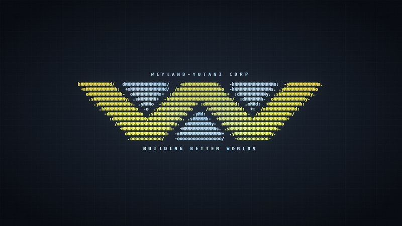</a><br><sub>Blueprint grid · <code>wy-4-blueprint-grid</code></sub></td>
</tr>
<tr>
<td width="50%"><a href="wallpapers/wy-5-graphite-horizon.png">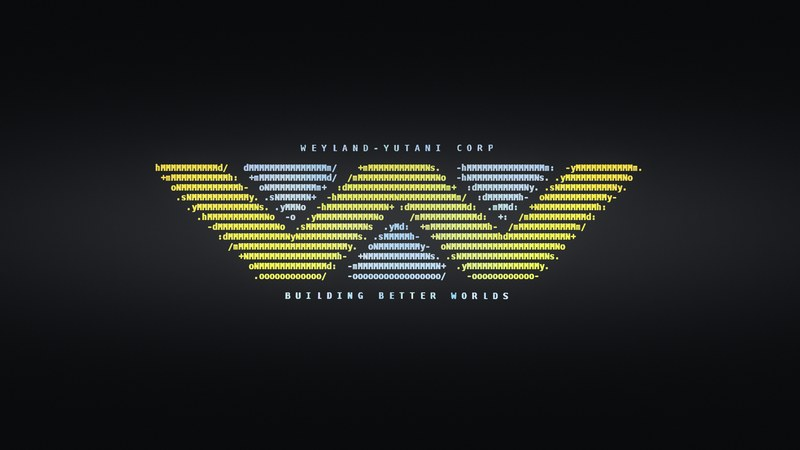</a><br><sub>Graphite horizon · <code>wy-5-graphite-horizon</code></sub></td>
<td width="50%"><a href="wallpapers/weyland-yutani-wallpaper-4k.png">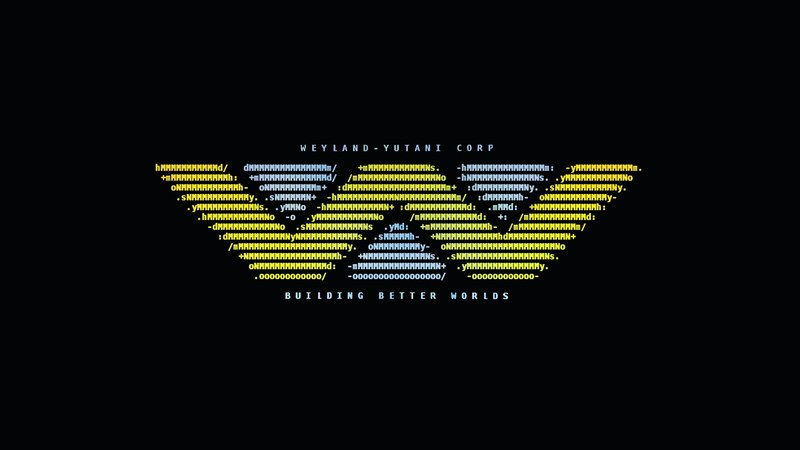</a><br><sub>Plain · <code>weyland-yutani-wallpaper-4k</code></sub></td>
</tr>
</table>

## Using a wallpaper

Right-click any PNG in `wallpapers/`, choose **Set as desktop background**,
then pick **Fill** under *Settings → Personalisation → Background* if Windows
asks how to fit it. The images are 16:9, so they fill 1080p, 1440p and 4K
screens without cropping.

## Requirements

- **Windows:** the scripts load Consolas and MS Gothic from `C:\Windows\Fonts`.
- **Python 3.12** (tested), with Pillow, NumPy and SciPy:

```bash
python -m pip install pillow numpy scipy
```

## Rendering basics

- Run every command from the **repo root**. The scripts use paths relative to it.
- Pass `-X utf8` to Python. Some scripts contain non-ASCII characters (`·`,
  katakana) and Windows otherwise reads them with the wrong encoding.
- Output goes to `wallpapers/`, overwriting the file of the same name.
- Each wallpaper takes roughly 6–10 seconds.
- Each render also writes a small 960×540 preview to `work/p-<name>.png`. These
  are git-ignored and handy for quick comparisons.
- Re-rendering gives a near-identical image: the random digit patterns are
  seeded and stay the same, but the faint film grain varies slightly each run.

### Rendering to a different folder

`logo_type.py`, `variants3d.py` and `corp.py` read the `WY_OUT` environment
variable. Set it to a folder path ending in `/` to try changes without
overwriting the committed wallpapers. `variants.py` and `plain.py` always write
to `wallpapers/`.

Bash (Git Bash):

```bash
mkdir -p out && WY_OUT=out/ python -X utf8 work/logo_type.py 12n-hybrid-two-tone
```

PowerShell:

```powershell
New-Item -ItemType Directory -Force out | Out-Null; $env:WY_OUT = 'out/'; python -X utf8 work/logo_type.py 12n-hybrid-two-tone
```

In PowerShell `$env:WY_OUT` stays set for the rest of that session. Clear it
with `Remove-Item Env:WY_OUT`.

## The wallpapers and how to render each one

Every script takes the names of the wallpapers (or functions) to render as
arguments. With no arguments, it renders everything it knows about.

### Workstation logo styles: `work/logo_type.py`

The green "WY-NET secure workstation" scene: dot grid, coordinate labels,
header and security notice. Each style re-sets the wing logo in Consolas.

```bash
# one style
python -X utf8 work/logo_type.py 12n7-bold-soft

# several styles
python -X utf8 work/logo_type.py 12n-hybrid-two-tone 12n2-pop-bold 12h-type-hex-stream

# every style
python -X utf8 work/logo_type.py
```

| Name | Logo |
|---|---|
| `12f-type-ascii` | the original characters, re-set in Consolas |
| `12g-type-fine-ascii` | a denser ASCII-art fill that traces the wing outline |
| `12h-type-hex-stream` | dense random hex digits |
| `12i-type-katakana` | half-width katakana and digits (MS Gothic) |
| `12j-type-wordmark` | repeating `WEYLAND-YUTANI·` text |
| `12m-hybrid-hex-ascii` | the original layout and edge punctuation, letters swapped for hex digits |
| `12n-hybrid-two-tone` | as 12m, with a warm-green / cool-teal split |
| `12n1-pop-bright` | 12n, brighter, with punchier colours |
| `12n2-pop-bold` | 12n in Consolas Bold, with punchier colours |
| `12n3-pop-glow` | 12n with a tight phosphor glow |
| `12n4-pop-backlit` | 12n on a darkened backing, with near-white highlight digits |
| `12n5-pop-sweep` | 12n with a diagonal "screen refresh" brightness band |
| `12n6-pop-combo` | bold, glow, backing and highlights together |
| `12n7-bold-soft` | 12n in Consolas Bold, with the softer colours |
| `12o-hex-stream-two-tone` | 12h with the two-tone split |

### Corporate set: `work/corp.py`

```bash
# everything in this script
python -X utf8 work/corp.py

# individual wallpapers
python -X utf8 work/corp.py survey orbital

# a single workstation variant
python -X utf8 work/corp.py workstation:green
```

| Argument | Output |
|---|---|
| `survey` | `wy-11-corporate-survey` (wireframe terrain, LV-426 survey readouts) |
| `orbital` | `wy-13-corporate-orbital` (dot-grid sky over terrain, heading tape) |
| `executive` | `wy-14-corporate-executive` (graphite dot grid, executive network) |
| `workstation_all` | all five workstation variants below |
| `workstation:orig` | `wy-12-corporate-workstation` (original-colour logo) |
| `workstation:green` | `wy-12b-workstation-green` (green monochrome logo) |
| `workstation:dots` | `wy-12c-workstation-dot-logo` (logo built from grid squares) |
| `workstation:dots-colour` | `wy-12d-workstation-dot-logo-colour` |
| `workstation:dots-bold` | `wy-12e-workstation-dot-logo-bold` |

### 3D backgrounds: `work/variants3d.py`

```bash
python -X utf8 work/variants3d.py terrain dotgrid
```

| Argument | Output |
|---|---|
| `corridor` | `wy-6-grid-corridor` |
| `horizon` | `wy-7-grid-horizon` |
| `terrain` | `wy-8-wireframe-terrain` |
| `planet` | `wy-9-planet-orbit` |
| `dotgrid` | `wy-10-dot-grid` |

### Gradient backgrounds and the plain version

These two scripts take no arguments.

```bash
python -X utf8 work/variants.py   # wy-1 … wy-5 (deep space, CRT, amber, blueprint, graphite)
python -X utf8 work/plain.py      # weyland-yutani-wallpaper-4k (near-black)
```

## Customising

### Make your own logo style

Styles live in the `STYLES` dict near the bottom of `work/logo_type.py`. Add
an entry and render it by name:

```python
STYLES={
 ...
 '12p-my-style':  lambda: s_hybrid(PAL2, base=0.9, bold=True, seed=42),
}
```

```bash
python -X utf8 work/logo_type.py 12p-my-style
```

`s_hybrid(...)` builds the hex-digit logo on the original character layout.
Its options:

| Option | Default | Effect |
|---|---|---|
| `pal` | subtle green pair | colour pair (warm, cool): `PAL2` soft, `PAL3` punchy |
| `base` | `0.85` | overall logo brightness (about 0.7–1.0 works) |
| `bold` | `False` | Consolas Bold digits |
| `seed` | `9` | which random digits appear; change it for a new pattern |
| `hi_rate` | `0.06` | share of digits drawn at full brightness |
| `hi_white` | `False` | draw those digits near-white instead of green |
| `glow` | `0` | tight phosphor glow strength (0.5–1.0 is subtle) |
| `sweep` | `None` | pass `sweep_fn` for the diagonal brightness band |
| `legacy` | `False` | the original digit order, used only so 12m/12n stay unchanged |

To also darken the background behind the logo, give the style as a tuple of
(function, strength). Strength runs from 0 to 1:

```python
 '12q-backed':  (lambda: s_hybrid(PAL2, bold=True), 0.4),
```

`typeset(...)` fills the wing silhouette on a fresh grid instead, which is
how the hex stream, katakana and wordmark styles work. Its options are `dens`
(grid density, 2 = twice as fine), `size` (font size), `fontfile`, `seed`,
`base` and `pal`. The first argument is a function that picks the character
for each cell; see `st_hex`, `st_kana` and `st_word` for examples.

### Change the colours

The two-tone pairs are defined near the top of `work/logo_type.py`, each as
(warm green for the originally yellow parts, cool teal for the originally blue
parts), in RGB:

```python
PAL2=(np.array([178,226,140],np.float32),np.array([105,190,198],np.float32))
PAL3=(np.array([196,236,128],np.float32),np.array([92,196,218],np.float32))
```

The background gradient is the `mix((20,34,32),(6,11,11),...)` line in
`scene()`: centre colour first, edge colour second.

### Change the on-screen text

The header (`WY-NET  SECURE WORKSTATION`), node ID, coordinate labels and
security notice are the `h.text(...)` calls in `scene()` in
`work/logo_type.py`. For the corporate set, edit the matching function in
`work/corp.py`. Text stays clear of the top-left corner (desktop icons) and the
bottom edge (taskbar). Keep new text in the top-right or bottom-right.

### Other resolutions

The canvas size is `W,H=3840,2160` at the top of `work/variants3d.py`, which
`corp.py` and `logo_type.py` also use. Layout positions are mostly relative,
but other sizes haven't been tested. Check the previews before relying on them.

## Rebuilding the logo from the photo

The original logo is a photo of a screen, so it was soft and noisy. These
scripts rebuild it as clean, sharp characters: they find the character grid,
identify every character, average the hundreds of repeats into clean letter
shapes, and re-draw them on a perfectly straight grid. The results are
already in `work/`:

- `logo_layer.png`, `logo_matte.png` and `logo_matte_text.png`: the clean logo
  and its masks.
- `layout.json`: every character's position, identity and original colour.
  The Consolas styles are built from this.

You only need to re-run the pipeline to change how the logo itself is
rebuilt. Run the four steps in order:

```bash
python work/phase.py         # 1. track the character grid across the photo
python work/cells.py         # 2. cut out every character cell and group similar ones
python work/crisp.py         # 3. identify each character by template matching
python work/render_logo.py   # 4. render the sharp logo and export layout.json
```

After that, re-render whichever wallpapers you want.

## Updating the gallery previews

After re-rendering or adding wallpapers, regenerate the previews:

```bash
python work/previews.py
```

This writes an 800×450 JPEG to `previews/` for every PNG in `wallpapers/`.
New wallpapers also need adding to the Gallery section above by hand.

## Licence

- **Code** (the Python scripts in `work/`): MIT. See [LICENSE](LICENSE).
- **Images and logo data** (`wallpapers/`, `images/`, and the logo data files
  in `work/`): unofficial fan art for personal, non-commercial use only. Not
  affiliated with or endorsed by 20th Century Studios, who own *Alien* and the
  Weyland-Yutani name and logo. See [NOTICE.md](NOTICE.md).
